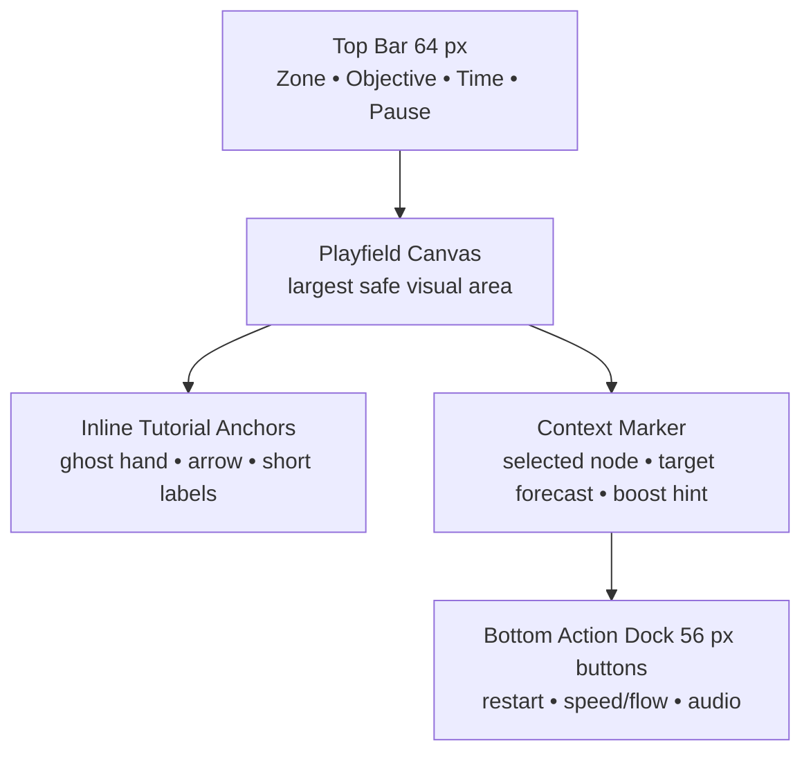
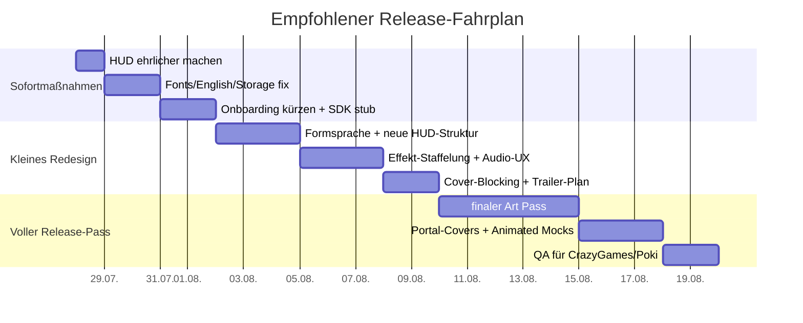

# StarConquest Neuausrichtung für CrazyGames und Poki

## Executive Summary

**Kurzurteil.** StarConquest hat bereits einen tragfähigen Kern: acht handgebaute Level, ein funktionierendes Echtzeit-Eroberungssystem mit Produktionsraten, Distanzkosten, aufladbaren Verbindungen, einem klaren Boost-Cut-Manöver, Sternwertung, Freischaltung per Fortschritt und einer leichtgewichtigen Canvas-Renderpipeline mit prozeduralem Sternenfeld und synthetischen Soundeffekten. Technisch ist das Fundament für ein schnelles Webspiel also vorhanden, und die bestehende Umsetzung ist klein, direkt und prinzipiell portalfreundlich. Gleichzeitig zeigt das Repository aber auch, dass die Produktidentität noch nicht abgeschlossen ist: Die README besteht nur aus `# Tentacle`, das Repository enthält neben `index.html` noch vier ältere HTML-Varianten, und mehrere ältere Dateien tragen noch den Titel „Tentacle Wars“, während der aktuelle Build „Star Conquest“ heißt. Das ist kein fertiges Produktbild, sondern ein umgeskinnter, noch nicht final markierter Prototyp. citeturn38view0turn39view1turn9view0turn9view1turn9view2turn9view3turn35view0

**Die wichtigste Diagnose.** Das Hauptproblem von StarConquest ist nicht die Kernmechanik, sondern die Verpackung: Marke, Tonalität, Informationsarchitektur, visuelle Hierarchie und Portal-Präsentation ziehen noch nicht in dieselbe Richtung. Besonders problematisch ist, dass zentrale UI-Informationen entweder irreführend oder schwach übersetzt sind: Das HUD-Feld „ENERGIE“ zeigt im laufenden Spiel den statischen `powerLimit`-Wert des Levels statt einer dynamischen Energiegröße; der Power-Bar vergleicht nicht Energie oder Produktionsstärke, sondern nur die Anzahl kontrollierter Systeme; und der 25/50/100-Selector ändert nicht eine sichtbare „Sendemenge“, sondern global `G.FLOW_RATE` für alle Strahlen. Das erzeugt den Eindruck von Strategie-Tiefe, kommuniziert die Regeln aber falsch. citeturn32view0turn32view2turn32view3turn23view0turn32view1turn25view0

**Portal-Fit heute.** Für CrazyGames und Poki ist der aktuelle Build in seiner jetzigen Form noch nicht einreichungsreif. CrazyGames fordert schnelle, klar visualisierte Onboarding-Phasen, lesbare Inhalte auf kleinen 16:9-Frames und englische Lokalisierung; Poki verlangt zusätzlich Mobile/Tablet-Support, 16:9-Scaling, Incognito-Sicherheit für `localStorage`, blockiert externe Requests wie Google Fonts standardmäßig und misst Conversion-to-Play, CTR und Aufenthaltsdauer sehr streng. StarConquest startet aktuell mit mehreren Overlay-Schritten vor dem ersten echten Spielzug, ist deutschsprachig, bindet Google Fonts extern ein, nutzt `localStorage` ohne den von Poki empfohlenen `try/catch`-Schutz und integriert weder Poki- noch CrazyGames-SDK-Ereignisse. citeturn41view0turn12view5turn11view5turn11view4turn37search2turn14view1turn14view4turn11view9turn11view6turn11view11turn21view0turn21view1turn21view2turn21view7turn35view0

**Was StarConquest braucht.** Ein reiner Polishing-Pass reicht nicht. Das Spiel braucht ein **echtes Redesign der audiovisuellen Präsentation**, aber **kein Redesign der Kernmechanik**. Empfohlen ist ein **kontrollierter Hybrid** aus einer breiten Richtung „Clean Galactic Tactics“ und einer eigenständigeren Richtung „Living Star Network“: also klare, plakative Space-Readability in UI, Farben und Thumbnail-Komposition – kombiniert mit leicht lebendigen, warmen System-Animationen, die die Mechanik emotional aufladen und den Tentacle-Wars-Klon-Eindruck brechen. So bleibt das Spiel web-tauglich, leicht lesbar, solo-produzierbar und bekommt trotzdem eine eigene Handschrift. citeturn12view3turn15view1turn15view2turn41view0turn18search12turn19search10turn33search1

**Empfohlene Priorität.** Erstens: UI-Wahrheit herstellen und Onboarding radikal verkürzen. Zweitens: eine klare Art Direction mit neuem Thumbnail-/Trailer-Hook definieren. Drittens: Portal-Hygiene herstellen – Englisch, SDK-Ereignisse, Font-Bundling, Incognito-Sicherheit, Mobile-Lesbarkeit. Viertens: erst danach in zusätzliche Effekte, Audio-Layer und Cover-Assets investieren. Damit steigt die Chance auf CrazyGames deutlich; für Poki wird das Projekt erst dann realistisch, wenn die visuelle Kohärenz, Thumbnail-Stärke und Early Conversion sichtbar höher sind. citeturn11view9turn14view1turn43view0turn44view1turn44view3turn37search5

## Bestand und Diagnose

**Arbeitsbasis.** Ich habe den live ausgelieferten GitHub-Pages-Build, die Rohquellen des aktuellen `index.html`, die vier älteren HTML-Varianten, die README sowie die offiziellen Portal-Dokumentationen untersucht. Das verfügbare Browser-Werkzeug erlaubt keine echte Canvas-Drag-Interaktion wie ein normaler Spieltest im Browser; Aussagen zum Mikro-Game-Feel beruhen deshalb auf der ausgelieferten Build-Struktur, dem sichtbaren DOM/CSS und dem tatsächlichen Simulations- und Rendercode des Live-Builds.

**Phase Eins – Fakten.** Der aktuelle Build ist ein einziges HTML-Dokument mit inline CSS und JavaScript. Die Grafik ist vollständig prozedural: Offscreen-Sternenfeld, Canvas-Systeme, Partikel, radiale Gradients, orbitale Ring-Elemente und Bead-basierte Energie-Strahlen. Die Spielsimulation läuft deltazeitbasiert mit `requestAnimationFrame`, `dt`-Clamp und Offscreen-Hintergrund-Caching beim Resize. Das ist für einen kleinen HTML5-Titel technisch sauber und für Web-Distribution günstig. Dazu kommen sechs prozedurale SFX-Ereignisse über Web Audio (`beam`, `capture`, `cut`, `boost`, `lose`, `win`), aber keine Musikschicht und kein Mute- oder Audio-Menü. citeturn22view0turn24view1turn31view0turn25view0turn24view4turn21view6turn27view4

**Phase Eins – Was bereits professionell wirkt.** Professionell oder zumindest brauchbar sind der Spielkern und Teile der technischen Umsetzung. Positiv sind insbesondere: das Distanzkostenmodell, die verständliche Besitzlogik, der aktive Verbindungsfluss mit `unitsInTube`, der Boost-Cut als mechanischer Twist, die Capture-Explosion plus Ring-Impuls, die kurzen Level mit Sternzeit-Zielen sowie die Tatsache, dass die alten Build-Dateien und die aktuelle `index.html` zeigen, dass hier bereits iteriert wurde. Ebenfalls gut ist, dass die Simulation framerateunabhängig gedacht ist und das Hintergrundbild nicht jedes Frame neu generiert wird. Das sind keine bloßen „Tech-Demos“, sondern echte Spielsysteme. citeturn24view3turn25view0turn31view0turn32view0turn24view4turn38view0

**Phase Eins – Was wie früher Prototyp wirkt.** Fast alles rund um Produktinszenierung und UX wirkt noch unfertig: die README enthält praktisch keine Dokumentation; das Repository heißt zwar StarConquest, die README aber „Tentacle“, mehrere alte Dateien heißen im `<title>` weiter „Tentacle Wars“, und das GitHub-Repository hat nicht einmal eine Beschreibung. Im laufenden Spiel sind Menüs, Labels und Erklärungen deutsch, Klassen-/Systemnamen englisch-futuristisch, und die Mechanik kommuniziert sich über Zahlensysteme und Klassenkürzel statt über eindeutige Formen. Das sieht nach einer funktionierenden Code-Version mit nachträglich aufgesetztem Skin aus – nicht nach einem aus einem Guss gedachten Produkt. citeturn38view0turn39view1turn9view0turn9view1turn9view2turn9view3turn35view0

**Phase Eins – Visuelle Probleme.** Die Systeme sind fast alle dieselbe Grundform: Kreise mit unterschiedlich vielen Ringschichten, ähnlichen Glows und einer winzigen Textkennung (`PULSAR`, `GIANT`, `QUASAR`, `NEXUS`). Mechanisch unterscheiden sie sich in Kapazität, Produktion, Beam-Limit, Ringzahl und Größe, aber visuell bleibt die Silhouette zu ähnlich. Auf Screenshots entsteht dadurch kein starkes Key-Art-Motiv, sondern eine Ansammlung kleiner HUD-artiger Zahlenkreise auf dunklem Blau. Die Strahlen sind technisch interessant, aber nicht ikonisch; im Standbild ist schwer zu erkennen, ob ein Frame gerade Angriff, Verteidigung, Übernahme oder nur Transfer zeigt. citeturn21view6turn31view0turn25view0turn24view0

**Phase Eins – UX-Probleme.** Der Weg zum ersten echten Spielzug ist zu lang: Hauptmenü → Levelauswahl → Levelintro → Startknopf. CrazyGames empfiehlt, neue Nutzer schnell ins Gameplay zu bringen, Onboarding innerhalb des Spiels zu halten, Text zu reduzieren und klare Buttons zu verwenden; Poki misst Conversion-to-Play über `gameplayStart()`. In StarConquest steht vor dem ersten Zug jedoch ein mehrstufiger Overlay-Funnel mit Story-Absatz und Stat-Boxen. Das ist für ein kurzes Portal-Strategiespiel zu viel Reibung. citeturn35view0turn28view2turn21view7turn41view0turn14view1turn11view6

**Phase Eins – Feedback-Probleme.** Die Simulation liefert Feedback, aber die wichtigsten Rückmeldungen sind nicht priorisiert genug. Capture hat Burst und Ring; Boost erzeugt ein Goldlabel; gefährdete Systeme zeigen eine Corona; Tooltips sind vorhanden. Was fehlt, ist eine saubere Informationshierarchie. Der Spieler braucht im Moment des Ziels noch klarer: „Kann ich das gewinnen?“, „Wie viel fließt?“, „Ist das ein Angriff oder Reinforcement?“, „Was ist gerade entscheidend?“ Der vorhandene Ratio-Preview am Ziel ist ein guter Ansatz, aber zu abstrakt und zu klein; die Strahl-Partikel selbst tragen einen Großteil der Information, statt dass Form, Farbe, Zielmarker und Impulstiming die Lesbarkeit übernehmen. citeturn31view0turn25view0turn24view0turn28view3

**Phase Eins – Marken- und Tonalitätsprobleme.** StarConquest klingt generisch-space-strategisch, während das Repository gleichzeitig noch „Tentacle“ sagt und ältere Builds offen biologistisch sind. Die aktuelle Fassung verwendet Space-Begriffe wie „Sternensysteme“, „Galaktische Strategie“ und „Flotte“, aber das Verhalten der Systeme und die ringförmigen Kreisformen tragen noch den Abdruck abstrakter Zell-/Node-Spiele. Es fehlt eine unverwechselbare emotionale These. Ist das kühl-taktisch? Heroisch? Elegant? Lebendig? Kinderfreundlich? Browser-arcadig? Aktuell lautet die Antwort: ein bisschen von allem, aber nichts konsequent. citeturn39view1turn35view0turn9view5turn21view6

**Phase Eins – Technische Probleme.** Aus Portalsicht sind vier Probleme sofort sichtbar: keine englische Fassung; externe Google-Fonts; `localStorage` ohne Poki-konformen Schutz für Incognito; keine Portal-SDK-Integration. Dazu kommt, dass der Build keinen von Poki/CrazyGames verwertbaren Gameplay-Lebenszyklus meldet und aktuell auch keine Portal-spezifischen Events, Cloud-Saves oder Metriken ausspielt. Rein technisch ist das klein und freundlich – publikationsseitig aber unvollständig. citeturn35view0turn11view5turn11view4turn37search2turn11view6turn11view11turn21view0turn21view1turn21view2

**Phase Eins – Leveldesign-Probleme, die wie Grafikprobleme erscheinen.** Ein Teil des „langweiligen Screenshot-Problems“ ist kein Grafikfehler, sondern ein Layout-/Pacing-Effekt. Viele Level setzen auf relativ wenige Systeme und weite Räume; das funktioniert mechanisch, erzeugt aber in Standbildern oft zu viel leere Dunkelheit. Dazu kommt, dass der Power-Bar nicht tatsächliche Kampfstärke zeigt, sondern nur Besitzanzahl. Ein scheinbar dramatisches Bild kann deshalb UI-seitig flach wirken. Anders gesagt: Ein Teil der schwachen Bildwirkung ist kompositorisch und informationsseitig, nicht nur „Art“-seitig. citeturn32view0turn23view0turn24view1turn31view0

**Phase Eins – Das härteste und wichtigste Detail.** `powerLimit` ist im aktuellen Build eine inszenierte, aber praktisch tote Variable. Sie taucht in den Leveldaten auf und wird in Intro und HUD eingetragen; in der Simulation selbst ist sie aber nicht als Limit, Regel oder Meter verdrahtet. Das ist exakt die Art von Pseudo-Information, die bei Spielern Verwirrung und Vertrauensverlust erzeugt. Wenn ein Webspiel in den ersten Sekunden eine zentrale Zahl anzeigt, die nichts Reales steuert, wirkt es unfertig. citeturn32view0turn32view2turn32view3

**Phase Eins – Bereichstabelle.**

| Bereich | Aktueller Zustand | Problem | Auswirkung auf Spieler | Priorität |
|---|---|---|---|---|
| Kernmechanik | Funktionsfähige Node-Conquest-Mechanik mit Energieproduktion, Strahlaufbau, Distanzkosten, Capture und Boost-Cut. citeturn24view3turn25view0 | Nicht das Problem; eher unterpräsentiert. | Guter Kern wird von schwacher Präsentation verdeckt. | P0 schützen |
| Repository/Marke | README nur `# Tentacle`; Repo ohne Beschreibung; ältere Dateien heißen weiter „Tentacle Wars“. citeturn38view0turn39view1turn9view0turn9view1turn9view2turn9view3 | Markenbild ist inkonsistent. | Wirkt wie umbenannter Prototyp statt wie fertiges Produkt. | P0 |
| Erstkontakt | Menükette mit Hauptmenü, Levelselect, Intro, dann erst Gameplay. citeturn35view0turn21view7 | Zu viel Reibung vor dem ersten Spielzug. | Schlechtere Conversion auf Portalen. | P0 |
| HUD-Logik | „ENERGIE“ zeigt `powerLimit`; Power-Bar zeigt Besitzanzahl statt Stärke. citeturn32view2turn32view3turn23view0 | Zwei Kernanzeigen kommunizieren das Falsche. | Verwirrung, Fehllesbarkeit, Prototypeindruck. | P0 |
| Transfer-Buttons | 25/50/100 ändern global `G.FLOW_RATE`. citeturn35view0turn32view1turn25view0 | UI suggeriert Sendemenge; Code ändert globale Simulationsgeschwindigkeit. | Regelverständnis leidet; UI lügt. | P0 |
| Visuelle Identität | Systeme sind Variationen desselben Kreises mit Ringzahl und Textlabel. citeturn21view6turn31view0 | Zu geringe Silhouetten-Differenzierung. | Schlechte Screenshot-Stärke und mobile Lesbarkeit. | P1 |
| Typografie | Orbitron + Share Tech Mono extern via Google Fonts. citeturn35view0 | Stil passt halb, aber ist extern geladen und Portal-unfreundlich. | Poki-CSP-Problem; unnötige Abhängigkeit. | P0 |
| Sprache | Build und UI deutsch; keine englische Lokalisierung im Code sichtbar. citeturn35view0turn12view5 | Portale verlangen Englisch. | QA-Risiko, geringere internationale Klarheit. | P0 |
| Audio | Synthetische SFX vorhanden; keine Musik; kein Mute. citeturn21view6turn27view4 | Funktional, aber dünn und ohne Komfortfunktionen. | Wenig emotionale Bindung, schwache Sieg-/Spannungsdramaturgie. | P1 |
| Mobile | Full-window Canvas und Bottom-Safe-Area; keine echte Top-Safe-Area, kein Portrait-/Landscape-UX-System. citeturn24view4turn29view0turn29view1 | Landscape-first ohne echte Mobilstrategie. | Auf kleinen Geräten eng und wenig robust. | P1 |
| Portalintegration | Kein PokiSDK, kein CrazyGames SDK, keine Gameplay-Events. citeturn21view0turn21view1turn21view2turn11view6turn11view11 | Submission-Hygiene fehlt. | Metriken, Ads, QA und Portalfeatures fehlen. | P0 |
| Incognito/Storage | `localStorage` wird direkt gelesen/geschrieben. citeturn21view7 | Poki empfiehlt `try/catch` wegen Incognito. citeturn11view4 | Potenzielles Funktionsrisiko auf Poki. | P0 |
| Cover/Marketing | Keine dedizierten Cover-/Trailer-Assets im Repo. Repo hat nur HTML-Dateien und Minimal-README. citeturn38view0turn39view1 | Portal-Marketingmaterial fehlt. | Schlechter Klick-Hook trotz brauchbarer Mechanik. | P1 |
| Content-Volumen | Acht Level mit Sternzeiten und Unlocks. citeturn32view0turn21view7 | Für ein starkes Portalprodukt noch knapp. | Weniger Langzeitbindung, wenn die Präsentation nicht kompensiert. | P2 |

## Markt, Portale und Positionierung

**Phase Zwei – Markt- und Konkurrenzbild.** Für StarConquest sind sechs Referenzfamilien wirklich relevant: erstens Tentacle Wars als Touch-orientierter, audiovisuell aufgeladener Node-Konflikt; zweitens Auralux als Minimal-RTS mit Musik-Fokus und sauberer Lesbarkeit; drittens Eufloria als Beweis, dass abstrakte Asteroiden warm, poetisch und emotional wirken können; viertens State.io als Beispiel, wie extrem reduzierte Gebietsübernahme in Thumbnails sofort lesbar wird; fünftens Portal-nahe „War State IO“-artige Browserstrategien, die auf schnelle Zielerfassung und kurze Sessions setzen; und sechstens die allgemeinen Portal-Richtlinien von CrazyGames und Poki, die frühe Verständlichkeit, starke Covers und geringe Reibung priorisieren. citeturn18search12turn19search10turn33search10turn33search1turn19search0turn20search1turn41view0turn14view1

**Tentacle Wars als Negativ- und Positivreferenz.** Tentacle Wars verkauft sich bis heute explizit als intensives audiovisuelles Strategieerlebnis, das Touch-Swipes und Schnitte in den Mittelpunkt stellt. Für StarConquest ist das wichtig, weil genau hier die Clone-Falle lauert: Man darf die klare Verbindungslogik, die gute Touch-Eignung und das befriedigende Cut-Feedback lernen – aber man darf nicht dieselbe biologische, spitzenbesetzte Zell-Optik, dieselbe Tentakel-Rhetorik oder diesen „im Organismus“-Look kopieren. Poki ist bei direkten oder stark angelehnten visuellen und UI-Kopien ausdrücklich streng, und CrazyGames verlangt ebenfalls Originalität bei Name, Assets und Gesamteindruck. citeturn18search12turn18search3turn15view1turn12view7

**Auralux als beste Referenz für „hochwertige Abstraktion“.** Auralux definiert sich selbst als „ambient RTS“, als auf den strategischen Kern reduziertes Echtzeitstrategiespiel, und betont zugleich, dass Musik und visuelle Pulsschläge eng mit der Schlacht verknüpft sind. Das macht Auralux für StarConquest so wertvoll: Es zeigt, wie Kreise, Partikel und Fluss ohne große Assetmenge luxuriös wirken können. Übernehmbar sind: die Konsequenz der Farbtrennung, die rhythmische Audio-Visual-Synchronität, das ruhige, elegante Bewegungsmuster und die Idee, dass „wenig“ nicht „billig“ heißen muss. Nicht kopiert werden sollte die extreme Langsamkeit und meditative Kühle eins zu eins; Portalspieler brauchen bei StarConquest mehr Sofortigkeit und klarere UI-Hooks. Der Umsetzungsaufwand für diese Lehren ist niedrig bis mittel, weil sie primär in Motion, Timing, Audio und Farbregeln liegen – nicht in Content-Massen. citeturn19search10turn33search2turn33search10

**Eufloria als Referenz für Wärme im Weltraum.** Eufloria HD beschreibt sein Setting als Eroberung von Asteroiden mit gewachsenen Kreaturen und floralem Leben. Für StarConquest ist das die wichtigste Gegenthese zum kalten Standard-Sci-Fi: Weltraum muss nicht nach blauem HUD und Militärdiagramm aussehen. Übernehmbar sind die warme Hintergrundsprache, das Gefühl lebender Systeme und die leise organische Poesie, die abstrakte Strategie emotionaler macht. Nicht ratsam wäre, in ein träges Pflanzen-RTS umzuschwenken; StarConquest lebt stärker von Klarheit, Tempo und Attacke. Der Umsetzungsaufwand für eine „wärmere Abstraktion“ ist mittel, weil Farbwelt, Idle-Animation und Soundwelt neu gedacht werden müssen, ohne die Lesbarkeit zu verlieren. citeturn33search1turn33search13

**State.io als Referenz für sofortiges Screenshot-Verständnis.** State.io positioniert sich als abstraktes Echtzeit-Strategiespiel und Gebietsübernahme-Spiel. Sein wichtigster Lerneffekt für StarConquest ist nicht die Weltkarten-Optik, sondern die Portal-Lesbarkeit: Ein Screenshot erklärt in einer Sekunde Besitzverhältnisse, Konfliktachsen und Fortschritt. Übernehmbar sind starke Flächenkontraste, eindeutige Fraktionsfarben, plakative Zentralziele und ein Fokus auf „was dominiert gerade wen?“. Nicht kopiert werden sollte die ultraflache Hypercasual-Anmutung; StarConquest braucht mehr Wertigkeit und weniger Wegwerf-Grayboxing. Aufwand: niedrig, weil es vor allem klügere Komposition, Farbe und UI-Ehrlichkeit sind. citeturn19search0turn19search4turn33search7

**Portal-nahe Browserstrategie.** CrazyGames listet Strategy, Space, Mouse und Mobile als wichtige zugängliche Sparten; Poki misst sehr sichtbar CTR, Conversion-to-Play und durchschnittliche Zeit auf der Seite. Für StarConquest folgt daraus: Ein erfolgreiches Portal-Strategiespiel muss nicht tief sein wie ein 4X, sondern muss in Sekunden lesbar, in Minuten befriedigend und in Thumbnails eindeutig sein. Strategie ohne massive Textlast ist deshalb kein Nice-to-have, sondern Portalökonomie. citeturn18search0turn20search2turn20search3turn14view1turn11view9

**Phase Zwei – Gesicherte Plattformanforderungen.** CrazyGames fordert lesbare Inhalte auf gängigen Desktop- und Mobile-Framegrößen, intuitive Controls, englische Lokalisierung, schnelle Performance, originelle Inhalte und hochwertige Covers samt Vorschauvideo. Außerdem gilt: Für mobile Homepage-Eignung sollte der Initial-Download unter 20 MB bleiben; Benchmark-orientiert nennt CrazyGames für stark performende Basic-Launch-Titel 80%+ Conversion, unter zehn Sekunden Ladedauer und Builds unter 20 MB. Poki verlangt Mobile/Tablet-Support, 16:9-Scaling, Incognito-Sicherheit, blockiert externe Requests wie Google Fonts standardmäßig, verlangt vor globalem Release eine statische Thumbnail-Datei und später ein animiertes Thumbnail und misst im Web Fit Test CTR, Average Time on Page und Conversion to Play. Pokis Player-Fit-Test zielt außerdem auf mehr als drei Minuten durchschnittliche Spielzeit und mindestens 25% der 500 Gameplays über drei Minuten. citeturn12view5turn11view1turn11view9turn43view0turn11view5turn11view4turn37search2turn14view1turn14view2turn44view3turn14view4

**Phase Zwei – Ableitung für StarConquest.** Daraus folgen drei harte Designregeln. Erstens: Das erste spielbare Verständnis muss praktisch ohne Lesen funktionieren, weil beide Portale frühe Reibung bestrafen und Poki Conversion-to-Play explizit misst. Zweitens: Die visuelle Sprache muss originell genug sein, um weder auf Poki noch auf CrazyGames als austauschbarer Clone unterzugehen. Drittens: Thumbnail und Fünfsekunden-Clip müssen eine klare Konfliktachse zeigen – nicht nur hübsche Kreise. StarConquest braucht also nicht „mehr Space-Art“, sondern **besseres visuelles Framing des bereits vorhandenen Konflikts**. citeturn41view0turn15view1turn14view1turn43view0turn44view1

**Phase Drei – Zielgruppen.** Realistisch am besten passen drei Zielgruppen: erstens erwachsene Casual-Spieler und ältere Teens, die kurze strategische Puzzle-Sessions mögen; zweitens Mobile-/Tablet-Spieler, die ein klares Drag-Spiel mit wenig Text schätzen; drittens Optimierer, die Sternzeiten wiederholen und „nur noch ein Level“ spielen. Weniger sinnvoll ist eine aktive Ansprache ganz kleiner Kinder oder Core-Midcore-RTS-Fans, die Tech-Trees, Fraktionen, Forschungsbäume und tiefe Makroökonomie erwarten. Für Portale sollte StarConquest primär als **Strategie-Puzzle-Hybrid** verkauft werden: sofort verständlich wie ein Casual-Game, aber mit genug Kontrolltiefe, um Timing und Routenwahl zu belohnen. Diese Einordnung ist auch deshalb passend, weil Poki zwar family-friendly und web-first priorisiert, aber zugleich polierte, originelle, klare Spielkerne sucht. citeturn15view2turn15view4turn14view4turn11view9

**Phase Drei – Empfohlene emotionale Positionierung.** StarConquest sollte nicht kalt-militärisch, aber auch nicht albern-kleinkindlich wirken. Die beste Zielstimmung ist: **clever, energisch, elegant und belohnend**. Startbildschirm: Gefühl von Kontrolle und „Ich kann das sofort anfassen“. Erfolgreicher Angriff: gespannte Entladung und kinetische Befriedigung. Levelsieg: saubere Dominanz plus Lust auf Perfektion. Der Re-Queue-Trigger für das nächste Level sollte nicht Story sein, sondern Momentum: „Ich hab’s verstanden – jetzt schaffe ich es noch schöner, schneller, sauberer.“ Das passt zu kurzen Levelstrukturen und Sternwertung deutlich besser als Lore oder Metaprogression. citeturn32view0turn14view4turn11view9

**Emotionale Produktformel.**  
*Ein sofort verständliches Weltraum-Strategie-Puzzle, das sich präzise und lebendig anfühlt, klar und hochwertig aussieht und dem Spieler das Gefühl gibt, Energieflüsse mit einem einzigen cleveren Zug in einen dominanten Sieg zu verwandeln.*

**Positionierungssatz.**  
*StarConquest ist ein web-first Strategie-Puzzle über das Erobern und Umlenken von Energie-Netzwerken – schnell lesbar, kurzweilig spielbar und visuell stark genug für Portal-Thumbnails.*

**Zentrales Spielversprechen.**  
*Draw links, reroute power, collapse the enemy network before they understand what happened.*

**Drei Taglines.**  
*Claim the stars. Control the flow.*  
*Link fast. Cut smart. Conquer clean.*  
*Tiny systems, huge reversals.*

**Gewünschtes Spielgefühl.**  
Nicht episch-groß, sondern scharf und elegant. Nicht niedlich-naiv, sondern freundlich-präzise. Nicht meditativ-langsam, sondern kontrolliert-dynamisch. Nicht abstrakt um der Abstraktion willen, sondern abstrakt mit emotional lesbaren Impulsen.

## Breite Designpfade

**Phase Vier – Vollständig unterschiedliche, massenkompatible Richtungen.** Die drei Richtungen unten sind bewusst keine bloßen Recolors. Sie unterscheiden sich in Zielgruppe, Stimmung, UI-Sprache, Thumbnail-Verhalten und Tonfall – bleiben aber jeweils für einen Solo-HTML5-Entwickler realistisch.

### Richtung eins: Clean Galactic Tactics

| Punkt | Ausarbeitung |
|---|---|
| A | **Arbeitstitel:** Clean Galactic Tactics |
| B | **Kernidee:** Ein kristallklares, modernes Space-Interface, das die Mechanik als elegantes Energie-Schachbrett verkauft. Die Systeme wirken wie hochwertige, leuchtende Orbitalknoten statt bloße Kreise. Alles ist auf Lesbarkeit, Flow-Richtung und Konflikt-Hierarchie optimiert. Die Stimmung ist kontrolliert, präzise und hochwertig, aber nicht steril. Der Stil soll deutlich origineller als ein Tentacle-Wars-Re-Skin sein und dennoch sofort als Strategie erkennbar bleiben. |
| C | **Zielgruppe:** Erwachsene Casual-Spieler, Teens, Puzzle-Strategen, CrazyGames-Strategy-Audience, mobile Spieler mit Sinn für klare UI. |
| D | **Emotion/Stimmung:** Grundstimmung: souverän, klar, aufgeladen. Spielgefühl: präzise Kontrolle. Spannungsniveau: mittel bis hoch. Humorgrad: sehr niedrig. Ernsthaftigkeit: mittel. Geschwindigkeit: zügig. Belohnung: „Ich habe das Schlachtfeld sauber gelesen und sauber gelöst.“ |
| E | **Visueller Stil:** Hintergrund = tiefer Marine-Schwarzraum mit zwei weichen Nebelinseln und wenigen hellen Sternclustern. Systeme = glasartige Knoten mit leuchtendem Kern und klarer Außenkontur. Verbindungen = geordnete Plasmakanäle mit Flussrichtung durch segmentierte Partikel. Neutrale Systeme = blaugraue, ruhige Knoten. Gegner = korallenrot bzw. bernsteinorange. Spezialsysteme = Formvariante plus internes Glyph-Muster. Levelauswahl = Kartenraster mit großem Missionstitel und 3-Sterne-Leiste. Menü = heroischer Titel, ein Haupt-CTA, ein kurzer interaktiver Tutorial-Loop im Hintergrund. Buttons = breiter, kontrastreicher, labels in sentence case. Panels = halbtransparente dunkle Karten mit klaren Eckenradien. Icons = dünn, geometrisch, nicht skeuomorph. Sterne = leuchtende Embleme statt Standard-★. Sieg/Niederlage = kurzer Zoom-Impuls plus große Ergebnisseite. Tutorialhinweise = im Spielfeld verankerte Pfeile und Ghost-Gesten. |
| F | **Formen/Silhouetten:** Spieler- und neutrale Grundform bleibt rund, aber jeder Systemtyp bekommt eine sekundäre Silhouette: Pulsar = einfacher Ring; Giant = doppelter Ring mit Satellitenpunkt; Quasar = dreiflügelige Energieblende; Nexus = sechsfeldiger Innenkern. Grund: Erkennbar ohne Text. |
| G | **Farbpalette:** Hintergrund `#06101E`, Tiefenfläche `#0A1830`, Spieler `#57C2FF`, Gegner `#FF5B77`, Gegner zwei `#FFB357`, Neutral `#93A5C2`, Energie `#DFF7FF`, Warnung `#FFC857`, Erfolg `#67F0A4`, UI-Flächen `#0D1628`, Text `#EAF2FF`, Akzent `#8EE6FF`. Farbschwächen-sicher, da Blau/Rot nie allein über Helligkeit getrennt werden. |
| H | **Typografie:** Selbst gehostete `Oxanium` oder `Chakra Petch`; Headlines semibold bis bold; Buttons in Sentence Case, nicht Vollcaps; Zahlen breit und hoch lesbar; Missionsnamen kurz, maximal zwei Wörter; keine technizistischen Monospace-Flächen außer kleinen Debug-/Tooltip-Werten. |
| I | **Animation/Game Feel:** Produktion = Kern pulst alle 900 ms, Ring füllt sich kontinuierlich. Energiefluss = kleine Segmentperlen im Abstand von 10–14 px, bei hoher Produktion dichter und heller. Angriff = Zielkontur pulst 120 ms rot auf, dann 240 ms Nachglühen. Übernahme = 160 ms Einbruch des fremden Kerns, 220 ms Weißblitz, 320 ms Umfärbung, 400 ms Ring-Reset mit neuem Besitzglyph. Overload = enger, schneller Rim-Pulse plus kleine Auswurf-Funken. Boost-Cut = 70 ms goldener Schnittblitz, 120 ms Energie-Kompression im Nahbereich, 180 ms Schubpfeil Richtung Ziel, 240 ms Ziel-Impact. Knappe Rettung = letzter Restkern flackert 2–3 Mal mit Tonhöhenanstieg. Sieg = weite Netzpulse vom Spielerstartpunkt über alle Systeme; Niederlage = kurzer Desaturationsschlag. Sterne = nacheinander 0/220/440 ms. Nächster-Level-Unlock = Karte klappt auf und zeigt die neue Missionskachel. |
| J | **Audio/Musik:** Musikrichtung = leichte elektronische Strategy-Ambience mit perkussivem Puls; 90–110 BPM; Instrumente = Soft-Synth-Plucks, subtiles Pad, leise Transienten. Energiefluss = weiche Tick-Arpeggios. Angriffe = fokussierter Synth-Stab. Übernahme = aufsteigender Dreiklang. Boost = kurzer Pitch-Rise mit Sub-Kick. Sieg = heller Akkordaufstieg. Niederlage = tiefer fallender Ton. UI-Klicks = kurze, saubere Glas-Klicks. |
| K | **Sprachstil:** Sachlich, futuristisch, knapp, motivierend. Beispiele: „Start level“ → **Launch Mission**; „Mission geschafft“ → **Sector secured**; „Mission verloren“ → **Network collapsed**; „Neues System“ → **Node acquired**; „Boost bereit“ → **Cut for surge**; „Zu wenig Energie“ → **Insufficient charge**; Tutorial Verbinden → **Drag from your node to create a link**; Tutorial Durchtrennen → **Slice your own link near the source to surge power forward**; Sternziel → **3 Stars under 90s**; nächster Sektor → **New sector unlocked**. |
| L | **Marketingwirkung:** Thumbnail-Stärke hoch; Screenshot-Stärke hoch; Fünfsekunden-Clip-Stärke hoch; Verständlichkeit sehr hoch; mobile Attraktivität hoch; CrazyGames-Fit sehr hoch; Poki-Fit hoch; internationale Verständlichkeit hoch. |
| M | **Umsetzungsaufwand:** UI niedrig bis mittel; Assets niedrig; Animation mittel; Codeänderungen mittel; Audio mittel; Gesamt mittel. |
| N | **Risiken:** Kann für sehr junge Poki-Spieler etwas zu kühl wirken. Wenn zu technisch ausgeführt, droht „hübsches Dashboard statt lebendiges Spiel“. |
| O | **Beispielszene:** Links unten zwei blaue Knoten, rechts ein roter Nexus. Ein goldener Boost-Schnitt komprimiert einen blauen Strahl, der im nächsten Moment den neutralen Knoten in der Mitte übernimmt; zeitgleich pulst der rote Nexus warnend auf. Der Spieler blickt sofort auf die Mitte, dann nach rechts – genau dort, wo die Entscheidung kippt. |
| Mockup-Brief | **Erzeuge drei illustrative Mockups.** *Thumbnail:* 1600×900, Fokus auf einem blauen Großknoten links, rotem Nexus rechts, goldener Boost-Schlag diagonal zur Mitte; 5 Layer: BG-Nebel, Sternfeld, Nodes, Beams/FX, Logo; Logo unten links 96 px, maximal 15% Bildbreite. *Gameplay-Screenshot:* 1920×1080, sieben sichtbare Systeme, ein Capture-Flash in der Mitte, HUD reduziert auf Top-Bar und zwei Action-Chips unten; Grid-Abstand 32 px, Safe Margin 72 px. *HUD-Mockup:* 1920×1080 mit 64 px Top-Bar, 56 px Bottom-Chips, Pause-Button rechts oben 48 px, Missionziel mittig. Export PNG, sRGB, 2× Variantenset mit und ohne Logo. |

### Richtung zwei: Stellar Toy Command

| Punkt | Ausarbeitung |
|---|---|
| A | **Arbeitstitel:** Stellar Toy Command |
| B | **Kernidee:** Die Mechanik wird wie ein hochwertiges futuristisches Tischspiel für ein breites Publikum inszeniert. Systeme wirken wie greifbare Spielfiguren oder Magnet-Spielsteine, nicht wie abstrakte Programmierer-Kreise. Alles bekommt weichere Kanten, freundlichere Farben und ein klareres Casual-Gefühl. Strategie bleibt vorhanden, wirkt aber einladend statt einschüchternd. Das ist die Poki-freundlichste Mainstream-Variante. |
| C | **Zielgruppe:** Familienfreundliche Poki-Zielgruppe, jüngere Teens, Mobile-Casuals, Gelegenheitsspieler. |
| D | **Emotion/Stimmung:** Warm, freundlich, smart, leicht verspielt. Spannungsniveau mittel. Humorgrad leicht. Ernsthaftigkeit niedrig bis mittel. Geschwindigkeit flott, aber nicht aggressiv. Belohnung: „Ich habe die Spielsteine perfekt bewegt.“ |
| E | **Visueller Stil:** Hintergrund = sauberes Weltraum-Diorama mit sanften Sternsprenkeln und farbigen Nebelwolken wie Filz oder Papier. Systeme = kleine, charmante Planetoiden-Spielsteine mit klaren Besitzfarben und sanfter Plastizität. Verbindungen = freundliche, helle Energieschnüre mit sichtbarer Richtung. Neutrale Systeme = cremegrau oder mintgrau. Gegner = Himbeerrot und Mangoorange. Menü = spielzeughaftes Schaufenster, wenig Text, ein großes Play. Levelauswahl = Sektorkarten auf einer linearen Galaxiekette. Panels = dickere Kartenflächen mit weicherem Radius. Sterne = emaillierte Abzeichen. Tutorial = Hand-Icon und Ghost-Line. |
| F | **Formen/Silhouetten:** Runde, weiche Systeme; Giant mit kleiner Außenplatte; Quasar mit drei kleinen Orbit-Orbs; Nexus mit breiter Basisplatte. Formensprache: „collectible toy pieces“. |
| G | **Farbpalette:** Hintergrund `#101B2E`, Nebel `#243B63`, Spieler `#62D7FF`, Gegner `#FF718E`, Gegner zwei `#FFBA63`, Neutral `#C2D1D8`, Energie `#F3FCFF`, Warnung `#FFD45D`, Erfolg `#7AF2AE`, UI-Fläche `#15243B`, Text `#F8FBFF`, Akzent `#8FECFF`. |
| H | **Typografie:** Selbst gehostete `Baloo 2` oder `Nunito Sans` für freundlichere Lesbarkeit; Headlines bold; Buttons in klarer Verbform; Zahlen rund, groß; Missionstitel kurz und aktiv. |
| I | **Animation/Game Feel:** Produktion = leichter „toy hum“ plus sanftes Bouncen des Kerns. Energiefluss = runde Perlen mit 12 px Abstand. Angriff = Ziel macht kurzen Rückstoß von 4–6 px. Übernahme = Besitzfarbe läuft wie Emaille in den Rand. Boost-Cut = goldene Schere + kurzer Feder-Effekt; Energie schießt als dicker, freundlicher Impuls vor. Rettung = Knoten vibriert minimal, Kern flackert, dann stabilisiert er sich sichtbar. Sieg = Kette aus Sterne-Confetti und lichte Wellen. Niederlage = Teile stoppen, Licht dimmt. |
| J | **Audio/Musik:** Leichte Synth-Pops, weicher Bass, freundliche Klickpercussion; 100–115 BPM; UI-Sounds leicht „toy-tech“. Keine kindliche Clownigkeit, eher hochwertiges Casual. |
| K | **Sprachstil:** Freundlich und motivierend. Beispiele: **Start level → Start mission**; **Mission geschafft → Mission complete**; **Mission verloren → Try a new route**; **Neues System → New node online**; **Boost bereit → Surge ready**; **Zu wenig Energie → Need more charge**; Tutorial Verbinden → **Drag to link your worlds**; Durchtrennen → **Slice near the source to launch a surge**; Sternziel → **Clear in under 90s**; Sektor freigeschaltet → **Next sector unlocked**. |
| L | **Marketingwirkung:** Thumbnail-Stärke hoch; Screenshot-Stärke mittel bis hoch; Fünfsekunden-Clip-Stärke hoch; Verständlichkeit sehr hoch; mobile Attraktivität sehr hoch; CrazyGames-Fit hoch; Poki-Fit sehr hoch; internationale Verständlichkeit sehr hoch. |
| M | **Umsetzungsaufwand:** UI mittel; Assets mittel; Animation mittel; Codeänderungen niedrig bis mittel; Audio mittel; Gesamt mittel. |
| N | **Risiken:** Strategie-affine Spieler könnten die Verpackung zunächst zu leichtgewichtig einschätzen. Wenn überzogen, wirkt es generisch-mobile. |
| O | **Beispielszene:** Drei blaue Toy-Planeten links speisen einen neutralen Mittelstein; rechts zieht ein pinker Gegner bereits eine helle Schnur. Der blaue Spieler schneidet den eigenen Link, eine dicke Goldperle springt nach vorn, der Mittelstein kippt blau, und die Kamera wippt minimal nach. |
| Mockup-Brief | **Erzeuge drei illustrative Mockups.** *Thumbnail:* 1600×900, ein großer blauer Toy-Planet vorne, zwei pinke Gegner hinten, eine dicke Goldsurge quer durchs Bild; kein Text im Poki-Variantenset, Logo nur in CrazyGames-Variantenset. *Gameplay:* 1920×1080, 6–8 Systeme, größere Knoten als in Richtung eins, freundlichere Nebel, vereinfachte HUD-Karte. *HUD:* Top-Bar 60 px, Bottom-Chip-Stack 64 px mit großen Touch-Hitboxen 56×56. Layerreihenfolge: BG, Nebel, Toys, Links, UI, optional Logo. Export PNG + JPG-Vorschau, sRGB, Sharpen minimal. |

### Richtung drei: Neon Orbit Rush

| Punkt | Ausarbeitung |
|---|---|
| A | **Arbeitstitel:** Neon Orbit Rush |
| B | **Kernidee:** Die Mechanik wird als schnelle, visuell explosive Arcade-Strategie verkauft. Alles ist kontrastreicher, energischer und clip-stärker als in den anderen Mainstream-Richtungen. Diese Variante priorisiert Five-Second-Footage und CrazyGames-Klickkraft. Strategisch bleibt das Spiel identisch, fühlt sich aber deutlich schneller und härter an. |
| C | **Zielgruppe:** CrazyGames-Audience, ältere Teens, Desktop-Spieler, Spieler mit Affinität zu Neon/Arcade und hohem visuellen Rückkanal. |
| D | **Emotion/Stimmung:** Aufgeregt, dominant, elektrisch. Spannungsniveau hoch. Humorgrad sehr niedrig. Ernsthaftigkeit mittel. Geschwindigkeit hoch. Belohnung: „Ich habe ein chaotisches Schlachtfeld mit Stil gebrochen.“ |
| E | **Visueller Stil:** Hintergrund = dunkles Violett-Schwarz mit Neon-Nebel und radialen Energierissen. Systeme = harte Neon-Sphären mit kontrastreichem Core. Verbindungen = helle Spuren mit starkem Motion-Trail. Neutrale Systeme = kaltes Stahlgrau. Gegner = Magenta und Amber. Menüs = große Titel, wenig Text, Clip-artiger Hintergrund-Loop. Panels = kantiger, dünner, technoider. Sterne = Neon-Shards statt klassischer Sterne. Tutorial = nur ikonische Hand/Pfeil-Overlays. |
| F | **Formen/Silhouetten:** Mehr kantige Sekundärformen: Giant mit Oktagon-Ring, Quasar mit dreieckigem Kern, Nexus mit hexagonalem Außenring. |
| G | **Farbpalette:** Hintergrund `#0A0715`, Nebel `#28104A`, Spieler `#3EDCFF`, Gegner `#FF3C8C`, Gegner zwei `#FFA63A`, Neutral `#7D8AA8`, Energie `#E9FCFF`, Warnung `#FFD24D`, Erfolg `#76FFB6`, UI-Flächen `#141127`, Text `#F5F0FF`, Akzent `#C66BFF`. |
| H | **Typografie:** Selbst gehostete `Rajdhani` oder `Orbitron`, aber weniger Monospace-Flächen als aktuell; große Zahlen; CTAs kräftig; keine langen Missionssätze. |
| I | **Animation/Game Feel:** Produktion = schneller Kernpuls 650 ms. Energiefluss = Motion-Trail plus helle Knotenspuren. Angriff = Ziel zündet 2-Stufen-Hitflash. Übernahme = 80 ms Blackout im Ziel, dann starker Neon-Reignite. Boost-Cut = Blitzkante + Speedline + Zielschockring. Rettung = letzte fünf Prozent Lebensenergie werden als schneller, scharfer Puls dargestellt. Sieg = alle Spielerlinks laden sich hell auf und entladen sich simultan. Niederlage = Bild dunkel, Gegnerfarben leuchten nach. |
| J | **Audio/Musik:** Elektronische Action-Pulse, 118–128 BPM, knackige Percussion, schnelle Risers, tiefer Sidechain-Sub. UI weich, Gameplay hart. |
| K | **Sprachstil:** Knapp, aggressiver, aber nicht militaristisch. Beispiele: **Launch**; **Sector crushed**; **Network lost**; **Node seized**; **Surge now**; **Charge too low**; **Drag to strike**; **Slice to burst forward**; **3 Stars under 90s**; **Next zone unlocked**. |
| L | **Marketingwirkung:** Thumbnail-Stärke sehr hoch; Screenshot-Stärke hoch; Fünfsekunden-Clip-Stärke sehr hoch; Verständlichkeit hoch; mobile Attraktivität mittel bis hoch; CrazyGames-Fit sehr hoch; Poki-Fit mittel; internationale Verständlichkeit hoch. |
| M | **Umsetzungsaufwand:** UI niedrig bis mittel; Assets niedrig; Animation mittel bis hoch; Codeänderungen mittel; Audio mittel; Gesamt mittel. |
| N | **Risiken:** Kann auf Poki zu hart oder zu „web-arcade generic neon“ wirken. Bei Übersteuerung verliert die Mechanik an Klarheit. |
| O | **Beispielszene:** Schwarzes Feld, zwei magentafarbene Gegnerketten rechts, ein türkiser Surge schneidet diagonal herein, goldene Boost-Partikel schieben den Strahl in einen grauen Orbit-Knoten, der innerhalb von 300 ms auf türkises Neon wechselt – perfektes Clip-Futter. |
| Mockup-Brief | **Erzeuge drei illustrative Mockups.** *Thumbnail:* 1600×900, diagonale X-Komposition, links unten Spieler, rechts oben Gegner, in der Mitte eine weiße Übernahmeexplosion; kein längerer Claimtext. *Gameplay:* 1920×1080, 8–9 Systeme, sichtbarer Motion-Trail, eine rote und eine orange Fraktion im Gegenspiel. *HUD:* extrem reduziert; 56 px Top-Bar, 48 px Corner-Buttons, untere Chips nur als Icons + Zahlen. Export PNG für Artwork, MP4-Vorgabe für späteres Clip-Blocking in 1080p/16:9 und 1080/1:1. |

## Spezifische Designpfade und Auswahl

**Phase Fünf – Drei mutigere Richtungen.**

### Richtung vier: Living Star Network

| Punkt | Ausarbeitung |
|---|---|
| A | **Arbeitstitel:** Living Star Network |
| B | **Kernidee:** Statt kalter Technik wirken die Systeme wie lebende kleine Sonnenwelten mit eigener Atmung, innerem Flimmern und sanfter Persönlichkeit. Das bricht die Tentacle-Wars-Nähe, ohne in Biologie-Horror zu rutschen. Die Welt ist warm, kosmisch und merkfähig; abstrakte Strategie bekommt emotionalen Körper. Das ist die stärkste eigenständige Alternative zur cleanen Standard-Sci-Fi-Schiene. |
| C | **Zielgruppe:** Spieler, die Atmosphäre mögen, erwachsene Casuals, designaffine Portalspieler, Nischenpublikum mit höherer Bindung. |
| D | **Emotion/Stimmung:** Geheimnisvoll, lebendig, warm, elegant. Spannungsniveau mittel. Humorgrad niedrig. Ernsthaftigkeit mittel. Geschwindigkeit kontrolliert. Belohnung: „Ich lenke ein lebendes Sternennetz.“ |
| E | **Visueller Stil:** Hintergrund = tiefer kosmischer Samt mit weichen, warmen Nebeln. Systeme = kleine Sonnen/Planeten mit atmendem Kern, Mikrowolken und Halo. Verbindungen = lebendige Lichtadern, nicht Tentakel, nicht Kabel. Neutral = ruhige, blasse „schlafende“ Welten. Gegner = aggressive, überhitzte Sterne. Menü = ruhige kosmische Bühne. Panels = schlank und zurückhaltend. Tutorial = leuchtende Runenpfeile, aber sehr sparsam. |
| F | **Formen/Silhouetten:** Weiche Rundformen, aber jede Klasse über Innenleben erkennbar: Pulsar = punktierter Kern; Giant = dicker Kernmantel; Quasar = strahlenförmige Dreiflügel; Nexus = großer Kern mit sechsteiligem Corona-Muster. |
| G | **Farbpalette:** Hintergrund `#090E18`, Nebel `#2A1D3B`, Spieler `#72D8FF`, Gegner `#FF6C72`, Gegner zwei `#FFBE6E`, Neutral `#9DA9BA`, Energie `#FFF5D8`, Warnung `#FFD166`, Erfolg `#7AF4BE`, UI `#101725`, Text `#F2F4FB`, Akzent `#C9B4FF`. |
| H | **Typografie:** `Sora` oder `Outfit` lokal gebündelt; clean, modern, nicht technoid; Überschriften semibold, Texte ruhig. |
| I | **Animation/Game Feel:** Produktion = langsames Atmen des Kerns; Energiefluss = pulsierende Ader mit Lichtpaketen; Angriff = Ziel wird sichtbar erhitzt/abgekühlt; Übernahme = Kern flackert kurz fremd, zieht sich zusammen und „erwacht“ neu in Spielerfarbe; Boost = Ader spannt sich kurz an, dann presst ein heller Lichtschub durch. Sieg = das ganze Netz atmet synchron. Niederlage = eigenes Netz verlöscht nacheinander. |
| J | **Audio/Musik:** Warm-ambient mit leisen Glöckchen, subtiles Pulsieren, 88–102 BPM; SFX eher schimmernd als hart. |
| K | **Sprachstil:** Ruhig, knapp, würdevoll. **Begin link**, **World secured**, **Signal lost**, **Node awakened**, **Surge available**, **Charge required**, **Draw light between your worlds**, **Cut close to the core to send a surge**. |
| L | **Marketingwirkung:** Thumbnail-Stärke mittel bis hoch; Screenshot-Stärke hoch; Fünfsekunden-Clip-Stärke mittel; Verständlichkeit hoch; mobile Attraktivität hoch; CrazyGames-Fit hoch; Poki-Fit mittel bis hoch. |
| M | **Umsetzungsaufwand:** UI niedrig; Assets niedrig bis mittel; Animation mittel; Codeänderungen mittel; Audio mittel; Gesamt mittel. |
| N | **Risiken:** Weniger unmittelbar „arcadig“ als Neon-Varianten. Wenn zu sanft, könnte die Angriffsdynamik weichgespült wirken. |
| O | **Beispielszene:** Ein blauer Stern pulst ruhig, ein feindlicher roter Stern überhitzt am rechten Rand. Zwischen beiden spannt sich eine helle Ader; nach dem Boost-Cut wird der neutrale Knoten in der Mitte zuerst weißglühend, dann tiefblau lebendig. |
| Mockup-Brief | **Erzeuge drei illustrative Mockups.** *Thumbnail:* 1600×900, ein großer atmender Stern im Vordergrund, eine Lichtader zur Mitte, warm-kosmischer Nebelhintergrund; kein UI. *Gameplay:* 1920×1080, 7 Systeme, ein Capture-Moment genau mittig, sanfte Nebel. *HUD:* sehr reduziert, dunkel-transparent, 60 px Top-Bar, 56 px Bottom-Actions, keine harten Rahmen. Layerliste: BG, Nebel, Worlds, Light Veins, FX, UI. Export PNG, 16-bit source optional, final 8-bit sRGB. |

### Richtung fünf: Retro Radar Armada

| Punkt | Ausarbeitung |
|---|---|
| A | **Arbeitstitel:** Retro Radar Armada |
| B | **Kernidee:** StarConquest wird als stilisierte Retro-Sci-Fi-Einsatzkonsole verkauft: grüne/bernsteinfarbene Vektorsysteme, Radarwellen, Scanringe, leichte CRT-Anmutung. Die Mechanik wird dadurch sofort eigenständig und klar „taktisch“, ohne realistisches 3D zu verlangen. Diese Richtung ist sehr merkfähig und solo-produzierbar. |
| C | **Zielgruppe:** Ältere Spieler, Design-Nischenpublikum, Desktop-Audience, Sci-Fi-Fans. |
| D | **Emotion/Stimmung:** Analytisch, retrofuturistisch, fokussiert. Spannungsniveau mittel. Humorgrad niedrig. Ernsthaftigkeit hoch. Geschwindigkeit mittel. Belohnung: „Mission Control unter Hochspannung.“ |
| E | **Visueller Stil:** Hintergrund = dunkle Kommandotafel statt Weltraumbild. Systeme = Radar-Pings und Zielretikel. Verbindungen = Vektorstrahlen mit Scanpunkten. Menü = Missionskonsole. Panels = klare Raster, dünne Linien. Sternewertung = militärische Einsatzabzeichen. Tutorial = Einsatznotizen und animierte Radar-Hand. |
| F | **Formen/Silhouetten:** Kreise, Retikel, Hex-Zielrahmen; sehr systemisch statt planetar. |
| G | **Farbpalette:** Hintergrund `#08110C`, Raster `#12301E`, Spieler `#7CFF8D`, Gegner `#FF7D7D`, Gegner zwei `#FFCA6B`, Neutral `#A7B7A9`, Energie `#E7FFEE`, Warnung `#FFD65A`, Erfolg `#9CFFB0`, UI `#0B140E`, Text `#DDF6E4`, Akzent `#86FFD8`. |
| H | **Typografie:** `JetBrains Mono` oder `Space Mono` lokal, kombiniert mit `Oxanium` für Headlines; alles „Ops console“. |
| I | **Animation/Game Feel:** Produktion = Radar-Pulse alle 800 ms; Energiefluss = scanline-artige Punkte. Angriff = Zielretikel schließt sich. Übernahme = Radar-Sweep färbt Besitz um. Boost = kurzer EMP-Schnitt und ein konzentrierter Signalburst. Sieg = sektorweiter Sweep. Niederlage = Signalrauschen und Offline-Dim. |
| J | **Audio/Musik:** Analoge Synths, Sonar-Pings, kurze Comm-Beeps, tiefer Drone-Bed. |
| K | **Sprachstil:** Knapp-operativ. **Deploy**, **Sector secure**, **Signal lost**, **Relay captured**, **Surge command ready**, **Charge insufficient**, **Drag to establish relay**, **Slice relay to pulse forward**. |
| L | **Marketingwirkung:** Thumbnail-Stärke mittel; Screenshot-Stärke hoch; Fünfsekunden-Clip-Stärke mittel; Verständlichkeit mittel bis hoch; mobile Attraktivität mittel; CrazyGames-Fit mittel bis hoch; Poki-Fit mittel. |
| M | **Umsetzungsaufwand:** UI mittel; Assets niedrig; Animation niedrig bis mittel; Codeänderungen mittel; Audio mittel; Gesamt mittel. |
| N | **Risiken:** Könnte für jüngere Portalspieler zu nüchtern oder zu retro-nischig wirken. |
| O | **Beispielszene:** Ein grünes Retikel hält links die Linie, rechts lockt ein roter Sektor. Nach dem Cut springt der Strahl als Radarimpuls vor; das neutrale Ziel in der Mitte kippt mit einem Scan-Sweep auf Grün. |
| Mockup-Brief | **Erzeuge drei illustrative Mockups.** *Thumbnail:* 1600×900, dunkle Konsole, ein hellgrünes Retikel zentral, ein roter Zielsektor oben rechts, kurzer Systemname sehr klein oder ganz ohne Text. *Gameplay:* 1920×1080, 8 Relays, sichtbares Raster, ein großer Sweep-Kreis. *HUD:* top-left mission code, top-center objective, top-right time/minimap bar. Export PNG, no-grain master + optional CRT overlay separat als Layer. |

### Richtung sechs: Cosmic Diorama Command

| Punkt | Ausarbeitung |
|---|---|
| A | **Arbeitstitel:** Cosmic Diorama Command |
| B | **Kernidee:** Das Spiel sieht aus wie ein gebautes Miniatur-Weltraumset: kleine Himmelskörper, Schichtnebel, papercraft-artige Schatten, fast wie ein luxuriöses Brettspiel-Set im Weltraum. Das erhöht Charakter und Thumbnail-Eigenständigkeit deutlich, ohne Asset-Explosion zu verlangen. |
| C | **Zielgruppe:** Familie-plus, designaffine Casuals, Spieler mit Freude an visueller Haptik. |
| D | **Emotion/Stimmung:** Charmant, handgemacht, taktisch. Spannungsniveau mittel. Humorgrad leicht. Ernsthaftigkeit mittel. Geschwindigkeit mittel. |
| E | **Visueller Stil:** Hintergrund = mehrere Tiefenebenen mit weichen Ausschnitten. Systeme = kleine Modell-Planeten mit Pappschatten und leuchtendem Pin. Verbindungen = helle Fäden/Laserbänder. Panels = „tabletop control cards“. Menü = Schaukasten. |
| F | **Formen/Silhouetten:** Klares Rundsystem, aber mit Boden-/Sockel-Schatten und Miniatur-Effekt. |
| G | **Farbpalette:** Hintergrund `#0C1322`, Tiefenebene `#18263F`, Spieler `#6ED3FF`, Gegner `#FF7387`, Gegner zwei `#FFC271`, Neutral `#C1CBD3`, Energie `#FAFDFF`, Warnung `#FFD45A`, Erfolg `#8BF2C1`, UI `#132033`, Text `#F4F7FB`, Akzent `#A6B9FF`. |
| H | **Typografie:** `Outfit` oder `Manrope`, lokal eingebunden; Buttons freundlich-klar, Zahlen groß. |
| I | **Animation/Game Feel:** Produktion = kleine Oberflächenpulsation. Energiefluss = Lichtfäden mit Mini-Welle. Übernahme = Besitz-Pin springt um. Boost = Faden schnappt und schießt als dicker Impuls nach vorn. Sieg = Diorama beleuchtet sich nacheinander. |
| J | **Audio/Musik:** Leichte, luftige Sci-Fi-Percussion plus weiche Bell-Sounds; weniger synthlastig als andere Richtungen. |
| K | **Sprachstil:** Freundlich-präzise. **Start mission**, **Board secured**, **Mission failed**, **Node captured**, **Surge ready**, **Need more power**, **Drag to connect**, **Slice to launch the charge**. |
| L | **Marketingwirkung:** Thumbnail-Stärke hoch; Screenshot-Stärke hoch; Fünfsekunden-Clip-Stärke mittel; Verständlichkeit hoch; mobile Attraktivität hoch; CrazyGames-Fit hoch; Poki-Fit hoch. |
| M | **Umsetzungsaufwand:** UI mittel; Assets mittel; Animation mittel; Codeänderungen mittel; Audio mittel; Gesamt mittel bis hoch. |
| N | **Risiken:** Wenn die Haptik zu dekorativ wird, verliert die Mechanik an Direktheit. |
| O | **Beispielszene:** Ein blauer Modellplanet mit heller Sockelschattierung verbindet sich zur Mitte; der goldene Surge hebt den Besitztoken auf einem neutralen Mini-Planeten sichtbar um und setzt einen blauen Marker darauf. |
| Mockup-Brief | **Erzeuge drei illustrative Mockups.** *Thumbnail:* 1600×900, großes Miniatur-Planetendiorama im Vordergrund, zwei gegnerische Token dahinter, eine dicke helle Verbindung. *Gameplay:* 1920×1080, 6–7 Systeme, klarer zentraler Konflikt, dezente Tiefenebenen. *HUD:* kartenartige Buttons, 64 px Edge Padding, 52 px Touch-Hitboxes. Export PNG, plus layered PSD/Figma-Struktur mit BG/Depth/Planets/Links/UI. |

**Phase Sechs – Vergleich aller sechs Richtungen.**

| Richtung | Breitenwirkung | Eigenständigkeit | Thumbnail-Wirkung | Mobile-Lesbarkeit | CrazyGames-Fit | Poki-Fit | Solo-Umsetzbarkeit | Langfristiges Potenzial | Risiko |
|---|---:|---:|---:|---:|---:|---:|---:|---:|---:|
| Clean Galactic Tactics | 9 | 7 | 8 | 9 | 9 | 8 | 9 | 8 | 4 |
| Stellar Toy Command | 8 | 6 | 8 | 9 | 8 | 9 | 8 | 7 | 5 |
| Neon Orbit Rush | 8 | 6 | 9 | 7 | 9 | 6 | 8 | 7 | 6 |
| Living Star Network | 7 | 9 | 7 | 8 | 8 | 7 | 8 | 9 | 5 |
| Retro Radar Armada | 6 | 9 | 6 | 7 | 7 | 6 | 9 | 7 | 7 |
| Cosmic Diorama Command | 7 | 8 | 8 | 8 | 8 | 8 | 7 | 8 | 6 |

**Rangliste für breiteste Marktchance.**  
Erstens **Clean Galactic Tactics**. Zweitens **Stellar Toy Command**. Drittens **Cosmic Diorama Command**.

**Rangliste für stärkstes eigenständiges Produkt.**  
Erstens **Living Star Network**. Zweitens **Retro Radar Armada**. Drittens **Cosmic Diorama Command**.

**Gesamtempfehlung.**  
Empfohlen ist ein **Hybrid aus Clean Galactic Tactics und Living Star Network**.

**Was aus Richtung A übernommen werden sollte:** klare Formhierarchie, ehrliche HUD-Struktur, hohe mobile Lesbarkeit, kontraststarke Besitzfarben, saubere Thumbnail-Komposition, präzise Beams, nüchterne CTAs.

**Was aus Richtung B übernommen werden sollte:** leicht lebendige Kernanimation, wärmere Nebel- und Hintergrundsprache, emotionalere Capture-Transformation, weniger sterile Kreisoptik, behutsam organische Audiofarbe.

**Was nicht kombiniert werden darf:** keine biologischen Tentakel, keine weichgespülte Lesbarkeit, keine Eufloria-artige Langsamkeit, keine technoiden Monospace-Flächen überall, keine übertriebene Neon-Härte.

**Warum daraus kein inkonsistenter Stil entsteht:** Die Hybridregel lautet: **UI und Regelkommunikation bleiben clean; Systeme und Feedback dürfen lebendig sein.** So bleibt die Informationsarchitektur klar, während die Welt emotionaler und weniger generisch wirkt. Das verhindert zugleich den Tentacle-Wars-Re-Skin-Eindruck und wahrt die Portal-Lesbarkeit. citeturn15view1turn15view2turn41view0turn19search10turn33search1

## Style Guide und Release-Plan

**Phase Sieben – Verbindliches visuelles Optimalrezept.**

**Verbindliche Designprinzipien.**  
Erstens: Jeder Systemtyp muss ohne Text an Innenform, Ringarchitektur und Idle-Motion erkennbar sein.  
Zweitens: Besitz wird immer durch **Farbe + Helligkeit + Kernmuster** kommuniziert, nie nur durch Farbe.  
Drittens: Strahlen dürfen spektakulär sein, aber nie die Besitzlesbarkeit des Zielsystems verdecken.  
Viertens: Jede wichtige Aktion erhält genau einen dominant lesbaren Effekt: Link-Erstellung, Hit, Übernahme, Boost, Niederlage, Sieg.  
Fünftens: HUD zeigt nur Größen, die im laufenden Spiel wahr sind. Keine dekorativen Scheinwerte.  
Sechstens: Das erste Level erklärt Verbinden und Schneiden im Spielfeld, nicht in Vortexten.  
Siebtens: Thumbnail und Trailer zeigen eine **konkrete Wendung** – neutrale Mitte kippt, feindlicher Nexus bricht, Boost-Schub trifft.  
Achtens: Für Poki/CrazyGames werden alle Fonts lokal gebündelt; externe Design-Abhängigkeiten sind verboten. citeturn32view2turn32view3turn37search2turn41view0

**Verbindliche Farbpalette und Einsatzregeln.**

| Einsatz | Farbe | Regel |
|---|---|---|
| Backdrop tief | `#06101E` | Vollflächiger Haupt-Hintergrund |
| Backdrop mid | `#0B1830` | Nebel-/Gradient-Zwischenlage |
| Spieler primär | `#57C2FF` | Nur für Besitz, aktive Links, Fokuszustände |
| Gegner primär | `#FF5B77` | Hauptgegnerfarbe |
| Gegner zwei | `#FFB357` | Nur in Drei-Fraktionen-Leveln |
| Neutral | `#93A5C2` | Niemals heller als Spieler/Gegner |
| Energie hell | `#EAF9FF` | Partikelkern, Zahlenhighlights |
| Boost | `#FFD45A` | Ausschließlich Boost, Sterne, wichtige Belohnung |
| Erfolg | `#67F0A4` | Sieg, bestätigte positive Zustände |
| Warnung | `#FFB347` | Kritische Systeme, fast verlorene Ziele |
| UI-Fläche | `#0D1628` bei 88% Opazität | Panels und Top-Bar |
| Text primär | `#ECF3FF` | UI-Text |
| Text sekundär | `#9EB4D0` | Hilfstexte, Nebentexte |

**Systemkatalog.**

| Typ | Form | Größe | Rand/Kern | Energieanzeige | Idle | Angriff | Übernahme | Gefahr | Maximum |
|---|---|---|---|---|---|---|---|---|---|
| Pulsar | einfacher Ring, punktierter Kern | 1.0× | dünner Rand, kleiner heller Kern | innerer 270°-Ring | 900 ms Puls | 2 kleine Hit-Pings | 200 ms Weißblitz, sofort neue Kernfarbe | schneller Rim-Pulse | äußerer Halo + dichter Kern |
| Giant | doppelter Ring, breiter Kernmantel | 1.25× | mittlerer Rand, schwerer Kern | geteilter Innenbogen | 1100 ms schwerer Atemzug | 1 Rückstoß + 1 Ringstoß | 260 ms Umfärbung über Rand nach innen | orange Warnsaum | zusätzlicher Satellitenpunkt erscheint |
| Quasar | runder Außenring, dreiflügeliges Innenmuster | 1.55× | klarer Rand, dynamischer Kern | drei leuchtende Segmente | 800 ms rotierendes Kernmuster | stärkerer Impact mit Segmentflare | 300 ms Kernkollaps, dann Neuaufbau | vibrierender Schimmer | Flügel glühen dauerhaft |
| Nexus | breiter Kreis mit sechsteiligem Corona-Muster | 1.95× | starker Rand, dichter Kern | dicker, umlaufender Power-Ring | 1400 ms tiefer Herzschlag | kurzer Bildschirm-Impuls 1–2 px | 360 ms Besitzwechsel mit Großring | Warnblitzen am Corona-Rand | zweite Außenkrone, stärkerer Halo |

**Verbindungsdarstellung.**

| Element | Spezifikation |
|---|---|
| Dicke Grundlinie | 4 px bei aktivem Link, 6 px Glowlayer dahinter |
| Flussrichtung | Segmentperlen mit hellem Kopf und dunklerem Schweif |
| Geschwindigkeit | Basis 90 px/s sichtbar; Boost-Schub 260 px/s für 220 ms |
| Partikelabstand | 12 px Standard; 8 px im Boost; 16 px bei niedriger Füllung |
| Angriffszustand | Zielseitiger Farbanteil steigt; letzte 20% vor Ziel werden heller |
| Verteidigungszustand | Link bleibt in Besitzfarbe, Zieloutline pulst in derselben Farbe |
| Unterbrochener Link | 70 ms Scherblitz, 100 ms Partikelsog zurück zur Quelle |
| Boost-Cut | goldene Schnittkante, kurzer Kompressionskeil und Zielshockring |
| Mehrere parallele Links | maximal zwei sichtbar übereinander; ab dem dritten nur breit zusammenfassen |
| Interne Links | etwas weicher und blasser als Angriffslinks |
| Feindlinks | niemals dieselbe Helligkeitskurve wie Spielerlinks |

**Empfohlenes UI-System.**  
Oben eine 64-px-Informationsleiste mit links Missionsname/Zone, mittig Zieltext, rechts Pause, Neustart und Laufzeit. Darunter **kein** irreführender „PowerBar“ mehr; stattdessen optional ein ehrlicher „Control Meter“, der entweder Besitzanzahl klar benennt oder komplett entfernt wird. Unten drei große Touch-Chips für Spawn-Rate/Transfer-Modus nur dann, wenn sie wirklich pro Spieleraktion gelten; andernfalls streichen. Ein zentrales Pause-Menü enthält Restart, Level Select, Audio und Controls. Tutorial-Hinweise erscheinen als verkürzte Inline-Captions am betroffenen Objekt. Portrait wird nicht unterstützt; das Spiel wird als Landscape-only eingereicht und über die Plattform rotieren gelassen. Poki und CrazyGames akzeptieren orientierungsgebundene Spiele, solange die Darstellung sauber skaliert. citeturn11view1turn11view5

**Effektbudget.**  
Pflicht: Link-Create, Hit, Capture, Boost-Cut, Danger, Win, Lose, UI-click.  
Optional: leichte Nebelbewegung, Selection-Pulse, Unlock-Animation.  
Vermeiden: dauerhafte Vollbildpartikel, permanentes Screen-Shake, Bloom-Overkill, volumetrische Rauchmassen, Shader-Orgien, die Mobile-Lesbarkeit killen.

**Animations-Timings.**

| Aktion | Timing |
|---|---:|
| Node idle pulse | 800–1400 ms je nach Typ |
| Link creation grow | 180–320 ms |
| Target hit flash | 120 ms + 240 ms fade |
| Capture flash | 220–360 ms |
| Boost cut anticipation | 70 ms |
| Boost discharge | 180–240 ms |
| Danger pulse repeat | alle 480 ms |
| Victory star pop | 0 / 220 / 440 ms |
| Button press scale | 90 ms |
| Overlay fade | 180 ms |

**Mikrotexte in Englisch.**

| Funktion | Primärtext | Deutsch optional |
|---|---|---|
| Start | Launch Mission | Mission starten |
| Retry | Retry | Nochmal |
| Next | Next Sector | Nächster Sektor |
| Level cleared | Sector secured | Sektor gesichert |
| Level failed | Network collapsed | Netzwerk zusammengebrochen |
| Objective | Capture all enemy nodes | Erobere alle feindlichen Systeme |
| Tutorial connect | Drag from your node to create a link | Ziehe vom eigenen Knoten, um zu verbinden |
| Tutorial cut | Slice your own link near the source to launch a surge | Schneide deinen Link nah an der Quelle für einen Schub |
| Low energy | Not enough charge | Zu wenig Energie |
| Node captured | Node acquired | System übernommen |
| Warning | Core under pressure | Kern unter Druck |
| Star target | 3 Stars under 90s | 3 Sterne unter 90 s |
| Pause | Paused | Pause |
| Resume | Resume | Fortsetzen |
| Controls | Controls | Steuerung |
| Audio | Audio | Audio |

**Priorisierte Soundliste.**

| Priorität | Sound |
|---|---|
| P0 | Link create |
| P0 | Target hit |
| P0 | Capture |
| P0 | Boost cut |
| P0 | Win sting |
| P0 | Lose sting |
| P1 | UI click |
| P1 | Node danger pulse |
| P1 | Menu open/close |
| P1 | Star award |
| P2 | Ambient loop level low-intensity |
| P2 | Pause ambience |
| P3 | Sector unlock flourish |

**Screenshot- und Thumbnail-Rezept.**  
Für das Gameplay-Screenshot sollte **eine neutrale Mitte gerade kippen**, während links Spielerblau und rechts Gegnerrot sichtbar sind. Ideal sind sechs bis acht Systeme, davon ein großer Nexus oder Quasar als Anker. Der Blick muss zuerst auf den Capture-Punkt fallen, dann entlang des Boost-Schubs zur Quelle. HUD nur minimal sichtbar: Top-Bar ja, Unterdock höchstens in reduzierter Form. Für CrazyGames-Cover gilt: kein simpler Screenshot, klare Hauptfigur/Hauptform, Spieltitel direkt auf der Cover-Datei möglich, 16:9/2:3/1:1 in konsistenter Bildsprache; für Poki gilt: quadratisches, vollflächiges Thumbnail ohne Padding oder Border, mindestens 628×628, möglichst textfrei, ein klarer Vordergrund-„Hero“-Knoten und hoher Kontrast zur Poki-Hintergrundfarbe `#83FFE7`. Für CrazyGames-Previewvideos sind 15–20 Sekunden ohne Ton vorgesehen; für Poki-Animated-Thumbnails 4–6 Sekunden, 1080×1080, 50 fps+, Fokus auf Gameplay, textarm, 2–3 Szenen. citeturn43view0turn44view1turn44view2turn44view3turn44view4

**Phase Acht – Konkrete Verbesserungen am aktuellen Build.**

| Task | Kategorie | Betroffene Dateien/Bereiche | Wirkung auf Spieler | Aufwand | Risiko | Abhängigkeiten | Priorität |
|---|---|---|---|---|---|---|---|
| HUD ehrlich machen: „ENERGIE“ entfernen oder korrekt definieren; Besitzbar klar benennen oder löschen | Neue UX / Text / Logik | `index.html` HUD DOM Zeilen 67–80, `loadLevel` 929–931, `update` 958–963. citeturn35view0turn23view0turn32view3 | Sehr hoch | 0.5–1 Tag | Niedrig | Keine | P0 |
| 25/50/100-Buttons ersetzen: echte Sendemengen-Logik pro Drag oder komplette Entfernung | Neue UX / neue Logik | `index.html` Transfer-Selector 77–80, `UI.init` 988–995, Beam-Update 607–617. citeturn35view0turn32view1turn25view0 | Sehr hoch | 1–2 Tage | Mittel | HUD-Redesign | P0 |
| Ersten Level direkt startbar machen; Overlays reduzieren | Neue UX / neue Texte | Main menu / level select / intro 82–128, UI flow 998–1024. citeturn35view0turn28view2turn21view7 | Sehr hoch | 1 Tag | Niedrig | Keine | P0 |
| Englisch als Primärsprache einziehen, Deutsch optional | Neue Texte | `index.html` komplette UI-Strings; später `strings`-Objekt | Sehr hoch | 1 Tag | Niedrig | Keine | P0 |
| Google Fonts entfernen; eine lokale WOFF2 oder Systemfont-Strategie verwenden | Reine CSS-Änderung / Plattformintegration | `@import` in Zeile 7 und zugehörige Font-Stacks. citeturn35view0turn37search2 | Hoch | 0.5 Tag | Niedrig | Schriftwahl | P0 |
| `localStorage` in `try/catch` kapseln; sichere Fallbacks | Neue Logik / Plattformintegration | `UI.init`, `showLevelSelect`, `showGameOver`. citeturn21view7turn11view4 | Hoch | 0.5 Tag | Niedrig | Keine | P0 |
| Poki- und CrazyGames-SDK-Lebenszyklus integrieren | Plattformintegration | Boot, Levelstart, Pause, Game Over; neue SDK-Wrapper-Datei empfohlen | Hoch | 1–2 Tage | Mittel | Englisch, UI flow | P0 |
| Branding säubern: README, Repository-Description, HTML-Titel, Dateiaufräumung | Neue Texte / Repo-Hygiene | `README.md`, GitHub metadata, alte `index1-4.html` archivieren/verschieben. citeturn38view0turn39view1turn9view0turn9view1turn9view2turn9view3 | Hoch | 0.5–1 Tag | Niedrig | Namensentscheidung | P0 |
| Systemtypen ohne Text lesbar machen | Canvas-Rendering / neue Assets | `StarSystem.draw` 484–560; `CLASSES` 171–176. citeturn21view6turn31view0 | Hoch | 2–3 Tage | Mittel | Farb-/Formsprache entschieden | P1 |
| Capture, Danger, Boost und Victory klarer staffeln | Neue Animationen / Canvas-Rendering | `Particles`, `StarSystem.draw`, `EnergyBeam.sever`, `showGameOver`. citeturn31view0turn25view0turn28view0 | Hoch | 2–3 Tage | Mittel | Art Direction | P1 |
| Pause-, Restart- und Audio-Buttons im Ingame-HUD | Neue UX / Audio | neue DOM-Elemente + Input-Handling | Mittel bis hoch | 1 Tag | Niedrig | HUD-Redesign | P1 |
| Safe Areas oben und echte Mobile-Hitboxes | CSS / UX | Top-HUD und Buttons. citeturn29view0turn29view1 | Mittel | 0.5–1 Tag | Niedrig | HUD-Redesign | P1 |
| Levelintro in kurze, grafische Mission-Cards umbauen | Neue UX / Texte | `levelIntro` Overlay | Mittel | 1–2 Tage | Niedrig | Englisch | P1 |
| Cover-Asset-Set für CrazyGames und Poki erstellen | Neue Assets / Marketing | neue `covers/`-Dateien, Trailer-Guides | Sehr hoch | 2–4 Tage | Niedrig | finale Art Direction | P1 |
| Lokale Audio-Optionen: Musikloop + SFX-Toggle | Audio / UI | neue Audio-Schicht, Settings | Mittel | 1–2 Tage | Niedrig | Pause-Menü | P2 |
| `index.html` entflechten in `style.css`, `game.js`, `ui.js`, `data.js` | Technischer Umbau | gesamter Code | Indirekt hoch | 2–4 Tage | Mittel | nach Optik-Freeze | P2 |
| Alte Testvarianten aus Root entfernen oder ins `/archive` verschieben | Repo-Hygiene | `index1-4.html` | Mittel | 0.5 Tag | Niedrig | Keine | P2 |
| Mehr Levels oder Daily/Challenge-Modus | Neue Logik / Content | `LEVELS` | Mittel | 3–5 Tage | Mittel | UX/Art fertig | P3 |

**Empfohlene Umsetzung in drei Phasen.**

**Phase Neun – Nicht kaputtoptimieren.**  
Nicht anfassen sollte man den eigentlichen Kern aus Produktionsknoten, Verbindungsaufbau, Besitzübernahme und Boost-Cut. Genau diese Mischung ist die beste Differenzierungsgrundlage. Ebenfalls behalten: kurze Missionen, Sternzeiten, klares Single-Screen-Format, einfache Drag-Eingabe, niedriges technisches Grundgewicht, prozedurales Rendering statt Asset-Flut und die Tatsache, dass das Spiel in wenigen Sekunden verständlich **werden kann**, wenn die UX bereinigt ist. Falsch wäre es, daraus ein 4X, ein Flotten-RTS, ein Storyspiel, ein Upgrade-RPG oder einen Live-Service zu machen. Das würde den größten Vorteil – kleine, direkte Webspielbarkeit – zerstören. citeturn24view3turn25view0turn32view0turn24view4

**Phase Zehn – Eindeutige Antworten.**

| Frage | Antwort |
|---|---|
| Wie stark muss StarConquest optisch verändert werden? | **Deutlich.** Nicht 20% mehr Polish, sondern eine klare Neudefinition von UI, Silhouetten, Effekthierarchie, Sprache und Marke. |
| Reicht ein Polishing-Pass? | **Nein.** Die Kernmechanik bleibt, aber Produktoberfläche und Markensignal brauchen ein echtes Redesign. |
| Beste massenkompatible Richtung? | **Clean Galactic Tactics.** |
| Stärkste spezielle Alternative? | **Living Star Network.** |
| Höchste Chance auf CrazyGames? | **Clean Galactic Tactics** oder der empfohlene Hybrid; klare Strategiesprache, gute Cover-Kompatibilität, starke 16:9-Lesbarkeit. |
| Höchste Chance auf Poki? | **Stellar Toy Command** für maximal breiten Familien-/Casual-Fit; nach UX-Bereinigung auch der Hybrid, wenn die Härte reduziert wird. |
| Wirtschaftlich sinnvollste Richtung für Solo-Entwickler? | **Clean Galactic Tactics.** |
| Am hochwertigsten ohne großen Scope-Anstieg? | **Hybrid aus Clean Galactic Tactics + Living Star Network.** |
| Drei visuelle Änderungen mit größtem Effekt? | **Ehrliches HUD**, **neue System-Silhouetten**, **echte Boost-/Capture-Inszenierung**. |
| Drei Änderungen als Zeitverschwendung? | **Lore-Ausbau**, **komplexe Metaprogression**, **3D-/Shader-Overkill**. |
| Sollte der Name „StarConquest“ bleiben? | **Eher nein.** Er ist funktionsfähig, aber generisch und wenig merkfähig. |
| Fünf bessere Namen | **Nova Relay**, **Pulsefront**, **Orbit Dominion**, **Starlink Surge**, **Constellation Cut**. |
| Ein-Satz-Beschreibung | *A fast, elegant web strategy puzzle where you link star systems, reroute power, and swing battles with perfectly timed cuts.* |
| 20-Sekunden-Trailer | 0–2 s: starker stiller Cover-Frame; 2–6 s: Drag zum ersten neutralen Knoten; 6–10 s: Gegnerdruck + knappe Verteidigung; 10–14 s: Boost-Cut in Großaufnahme; 14–18 s: Kettenübernahme, Sterne poppen; 18–20 s: Mission card + CTA. Für CrazyGames ohne Ton, für internes Pitching mit Ton. citeturn43view0turn44view3 |
| Reicht das Projekt nach Überarbeitung für eine Einreichung? | **Ja, realistisch für CrazyGames; bedingt realistisch für Poki nach stärkerem UX-/Thumbnail-/Portalpass.** Aktuell nein, nach empfohlenem Pass ja als ernstzunehmender Kandidat. citeturn42search3turn14view1turn15view2 |

**Klares Schlussurteil.**

| Feld | Urteil |
|---|---|
| Designrichtung | **Hybrid: Clean Galactic Tactics mit Living-Star-Wärme** |
| Zielplattform | **CrazyGames zuerst, Poki als zweiter Schritt** |
| Zielgruppe | **Erwachsene Casuals, ältere Teens, Strategie-Puzzle-Spieler, Mobile-Landscape-Nutzer** |
| Stimmung | **Klar, elegant, lebendig, dominant** |
| Visueller Hook | **Eine neutrale Sternmitte kippt durch einen goldenen Boost-Schub sichtbar zugunsten des Spielers** |
| Wichtigste Änderung | **HUD und Onboarding müssen wahr, schnell und visuell selbsterklärend werden** |
| Maximal sinnvoller Aufwand | **Ein ernsthafter 1–2‑Wochen-Visual-and-UX-Pass plus Cover-/Portalpaket** |
| Größtes Risiko | **Ein halbherziger Re-Skin, der weiter wie ein generischer oder angelehnter Node-Klon wirkt** |
| Konkreter nächster Arbeitsschritt | **In `index.html` zuerst HUD-Werte korrigieren, 25/50/100-Selector entweder entfernen oder korrekt umbauen, danach ein einziges Figma-/Mockup-Board für die Hybrid-Art-Direction blocken** |