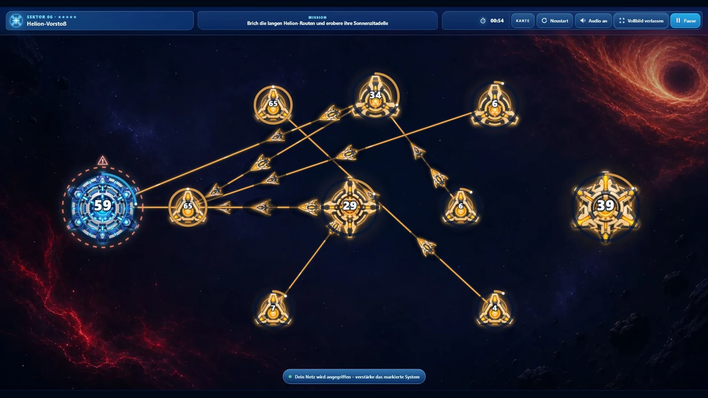
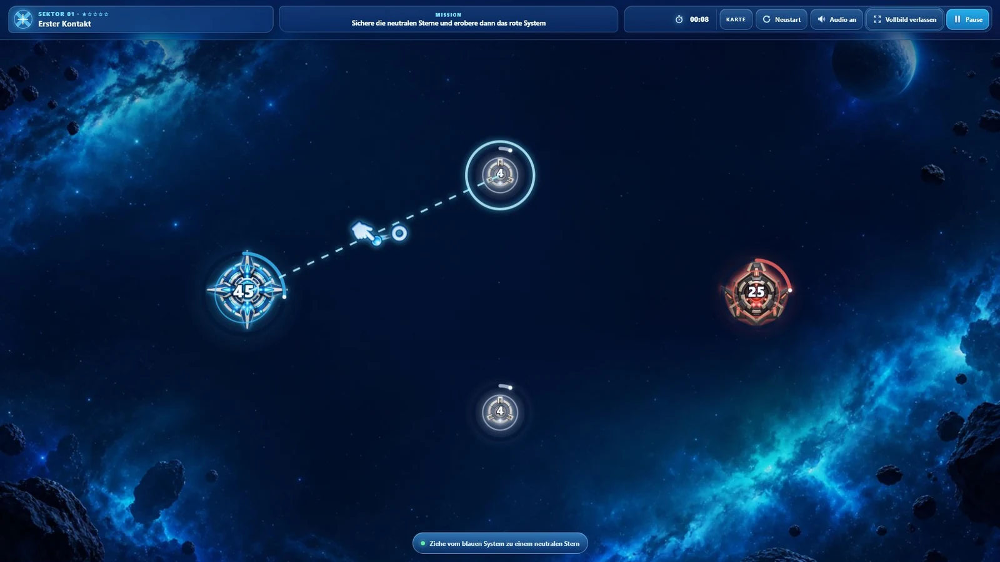
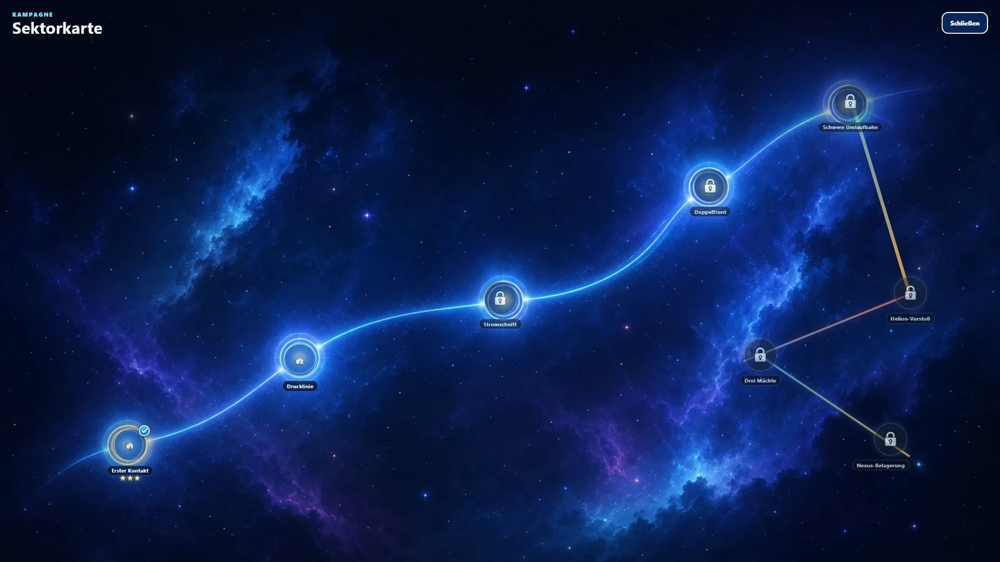
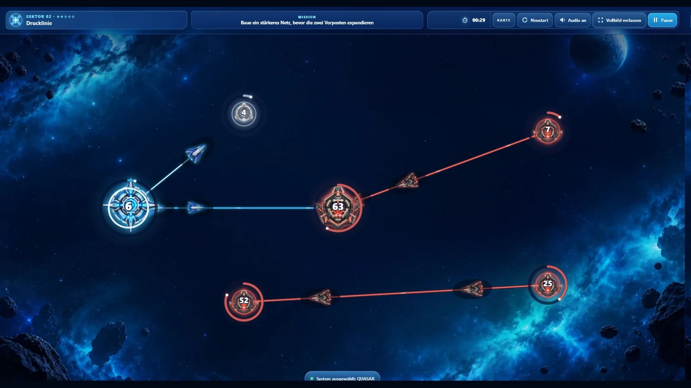

# StarConquest

StarConquest is a touch-first browser strategy game about drawing energy
corridors between star systems, building fleet pressure and cutting routes at
the right moment to launch a decisive surge.

[Play the campaign on GitHub Pages](https://emfau88.github.io/StarConquest/)



## The game

- Draw routes from your systems to reinforce allies or attack hostile worlds.
- Watch a marked pioneer ship establish each new corridor while an evenly
  spaced convoy follows without changing speed or formation at activation.
- Cut a charged corridor to send its forward fleet surging toward the target
  while the rear formation retreats.
- Contest reciprocal attacks at a shared battle front whose position reflects
  the strength of both source systems.
- Read free and occupied route slots directly on every system, then grow
  sufficiently charged systems into a larger class with more capacity and
  another outgoing route.
- Capture Pulsars, Giants, Quasars and fortified Nexus systems across eight
  progressively denser sectors.
- Face two visually and tactically distinct hostile factions, including the
  long-range orange Helion Compact.
- Play with mouse or touch in a responsive landscape layout with persistent
  campaign unlocks and best star ratings.

## From first contact to sector command

| Guided opening | Persistent campaign |
| --- | --- |
|  |  |
| The first sector teaches route creation directly on the battlefield. | Completed sectors, unlocks and best ratings remain available between sessions. |

### Pressure Line in motion



By sector two, both hostile outposts expand independently while the player
races to secure the central Giant and maintain a stable energy network.

## Campaign

1. **First Contact:** connect systems and expand through neutral space.
2. **Pressure Line:** react to two independently expanding enemy outposts.
3. **Cut the Current:** learn to turn stored route energy into a fleet surge.
4. **Twin Fronts:** prioritize between simultaneous attack lanes.
5. **Heavy Orbit:** manage every system class around a fortified Nexus.
6. **Helion Run:** counter the long routes of the Helion Compact.
7. **Three Powers:** survive a shifting conflict between three factions.
8. **Nexus Siege:** break two fortified hostile networks.

## Controls

- **Connect or attack:** drag from one owned system to another system.
- **Cut and surge:** swipe across an active corridor.
- **Manage the run:** use the HUD for the campaign map, restart, audio,
  fullscreen and pause.

## Development

StarConquest uses TypeScript, Vite and a custom Canvas 2D renderer. Gameplay is
driven by a fixed-timestep simulation and covered by automated mechanics,
campaign, balance and runtime-asset tests.

```powershell
npm.cmd install
npm.cmd run dev
npm.cmd test
npm.cmd run balance:sim
npm.cmd run build
```

The legacy source is frozen in [`reference/legacy-build/`](reference/legacy-build/).
The protected gameplay contract is documented in
[`docs/core-mechanics.md`](docs/core-mechanics.md), with the latest automated
balance report in [`docs/balance-report.md`](docs/balance-report.md).

Every push to `main` validates and publishes the production build through
GitHub Pages.
